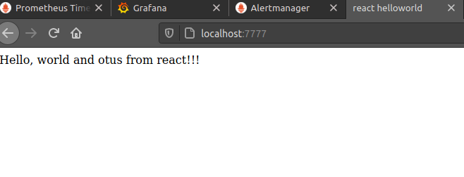

# react.js hello world
---
first, you should install node and npm.

1. create directory  
    `mkdir helloworld && cd helloworld`

2. init npm  
    `npm init`

3. install webpack and webpack-dev-server  
    `npm install webpack webpack-dev-server --save`

4. install react and react-dom  
    `npm install react react-dom --save`

5. install babel etc.  
    `npm install babel-core babel-loader babel-preset-react babel-preset-es2015 --save`

6. add start scripts to package.json
```javascript
    "scripts": {
      "test": "echo \"Error: no test specified\" && exit 1",
      "start": "webpack-dev-server --hot"
    }
```

7. touch webpack.config.js
```javascript
    var config = {
      entry: './main.js',

      output: {
        path: './',
        filename: 'index.js'
      },

      devServer: {
        inline: true,
        port: 7777
      },

      module: {
        loaders: [
          {
            test: /\.jsx?$/,
            exclude: /node_modules/,
            loader: 'babel',
            query: {
              presets: ['es2015', 'react']
            }
          }
        ]
      }
    }

    module.exports = config;
```

8. touch index.html
```html
    <!DOCTYPE html>
    <html>
      <head>
        <meta charset="utf-8">
        <title>react helloworld</title>
      </head>
      <body>
        <div id="app"></div>
        <script src="index.js" charset="utf-8"></script>
      </body>
    </html>
```

9. touch App.jsx
```javascript
    import React from 'react';

    class App extends React.Component {
      render() {
        return (
          <div>simon, helloworld!!!</div>
        );
      }
    }

    export default App;
```

10. touch main.js
```javascript
    import React from 'react';
    import ReactDOM from 'react-dom';

    import App from './App.jsx';

    ReactDOM.render(<App />, document.getElementById('app'));
```

11. start server  
    `npm start`

12. open browser: [http://localhost:7777](http://localhost:7777)



---
if you clone this repository to local, just `npm install` and `npm start`.
